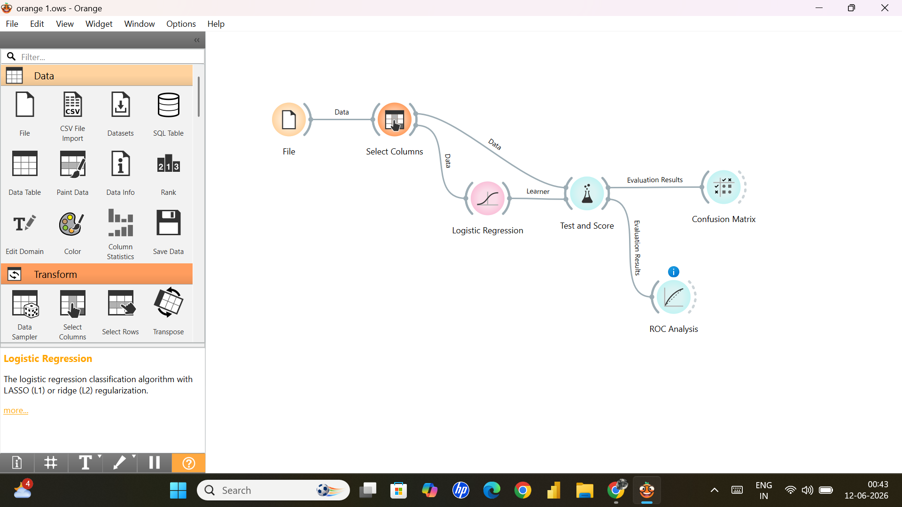
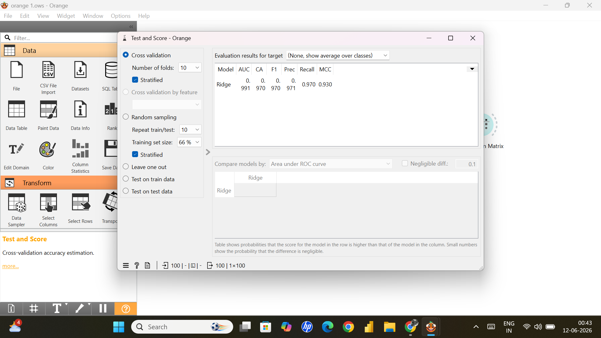
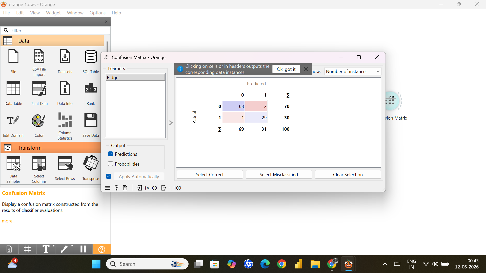

# 🚀 Loan Default Prediction using Logistic Regression (Orange)


---

## 📌 Project Overview

This project predicts **loan default risk** using **Logistic Regression (Ridge Regularization)** in Orange Data Mining.

The objective is to classify customers into:

- **0 → Non Default**
- **1 → Default**

---

## 🛠 Tech Stack

- Orange Data Mining
- Logistic Regression
- CSV Dataset
- ROC Analysis
- Confusion Matrix

---

## 🔄 Workflow

```text
File
 ↓
Select Columns
 ↓
Logistic Regression
 ↓
Test & Score
 ↓
├── ROC Analysis
└── Confusion Matrix
```

---

## 📊 Performance Metrics

| Metric | Score |
|--------|------|
| AUC | 0.991 |
| Accuracy | 97% |
| Precision | 97.1% |
| Recall | 97.0% |
| F1 Score | 97.0% |
| MCC | 0.930 |

---

## 📸 Screenshots

(Add section above)

---

## ▶️ How to Run

1. Install Orange
2. Open workflow (.ows)
3. Load dataset
4. Run evaluation
5. View results

---

## 🚀 Future Improvements

- Random Forest
- Feature Engineering
- Hyperparameter Optimization
- Larger Dataset

---

## 👨‍💻 Author
# 📸 Project Screenshots

## 🔷 Workflow
<p align="center">
  
</p>

---

## 🔷 Test & Score
<p align="center">
  
</p>

---

## 🔷 ROC Analysis
<p align="center">

</p>

---

## 🔷 Confusion Matrix
<p align="center">
  
</p>
**Rohit Pachori**  
MBA (Applied Finance)
