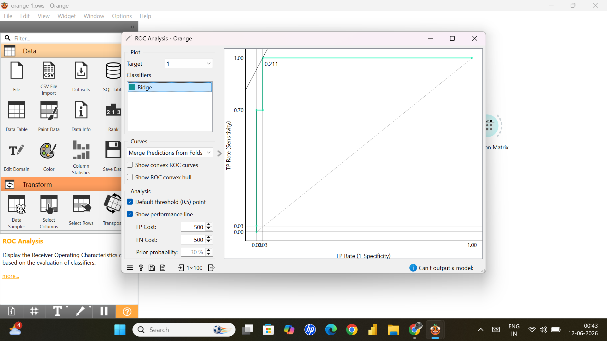

# 🚀 Loan Default Prediction using Logistic Regression (Orange Data Mining)


---

# 📌 Project Overview

This project demonstrates **Loan Default Prediction** using **Logistic Regression (Ridge Regularization)** in **Orange Data Mining (No-Code Machine Learning Platform).**

The objective is to predict whether a customer is likely to:

* **0 → No Default**
* **1 → Loan Default**

The workflow includes:

✔ Data Loading
✔ Feature Selection
✔ Logistic Regression Model
✔ Cross Validation
✔ Performance Evaluation
✔ ROC Analysis
✔ Confusion Matrix

---

# 🛠 Tools & Technologies

| Tool                | Purpose             |
| ------------------- | ------------------- |
| Orange Data Mining  | Workflow Creation   |
| Logistic Regression | Classification      |
| CSV Dataset         | Data Source         |
| ROC Analysis        | Model Evaluation    |
| Confusion Matrix    | Prediction Analysis |

---

# 📂 Dataset Information

Dataset contains:

* **100 Records**
* Multiple Loan Features
* Binary Classification Target

Example attributes:

* Applicant Income
* Credit Score
* Loan Amount
* Employment Status
* Existing Debt
* Loan Purpose
* Previous Defaults
* Default Label (0/1)

---

# 🔄 Project Workflow

```text
File
 ↓
Select Columns
 ↓
Logistic Regression
 ↓
Test & Score
 ↓
├── ROC Analysis
└── Confusion Matrix
```

---

# 📊 Model Evaluation Results

| Metric    | Score |
| --------- | ----- |
| AUC       | 0.991 |
| Accuracy  | 97.0% |
| Precision | 97.1% |
| Recall    | 97.0% |
| F1 Score  | 97.0% |
| MCC       | 0.930 |

---

# 📈 Performance Interpretation

### Accuracy → 97%

The model correctly predicts most loan outcomes.

### AUC → 0.991

Outstanding ability to distinguish default vs non-default.

### Precision → 97.1%

Predicted defaults are highly reliable.

### Recall → 97%

Model successfully identifies most actual defaults.

---

# 📉 Confusion Matrix

| Actual / Predicted |  0 |  1 |
| ------------------ | -: | -: |
| 0                  | 68 |  2 |
| 1                  |  1 | 29 |

### Insights

* True Negatives → 68
* False Positives → 2
* False Negatives → 1
* True Positives → 29

---

# 📸 Project Screenshots

## 🔷 Workflow

<p align="center">

</p>

---

## 🔷 Test & Score

<p align="center">

</p>

---

## 🔷 ROC Analysis

<p align="center">

</p>

---

## 🔷 Confusion Matrix

<p align="center">

</p>

---

# ▶ How to Run

### Step 1

Install Orange Data Mining

### Step 2

Clone Repository

```bash
git clone https://github.com/yourusername/orange.git
```

### Step 3

Open:

```text
loan_default_prediction.ows
```

### Step 4

Load Dataset

```text
loan_default_dataset_100_rows.csv
```

### Step 5

Run Workflow

---

# 🚀 Future Improvements

* Random Forest
* XGBoost
* Hyperparameter Tuning
* Larger Dataset
* Feature Engineering

---

# 📁 Repository Structure

```text
orange/
│
├── README.md
├── loan_default_dataset_100_rows.csv
├── imagesworkflow.png.png
├── imagestest_score.png.png
├── imagesroc_analysis.png
├── imagesconfusion_matrix.png.png
└── loan_default_prediction.ows
```

---

# 👨‍💻 Author

**Rohit Pachori**
MBA (Applied Finance)

Built using Orange Data Mining & Machine Learning
